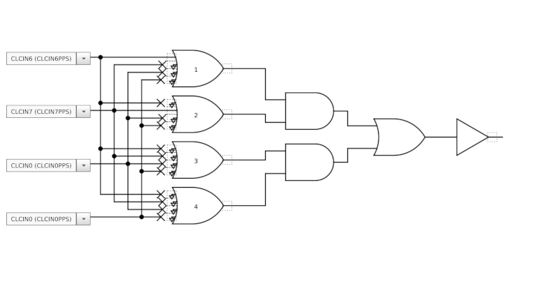

# N4OGW GPS Disciplined oscillator

This GPSDO is based on the Lars Walenius design posted on eevblog.com:

[https://www.eevblog.com/forum/projects/lars-diy-gpsdo-with-arduino-and-1ns-resolution-tic/](https://www.eevblog.com/forum/projects/lars-diy-gpsdo-with-arduino-and-1ns-resolution-tic/)

The code has been translated from the Arduino to PIC, a
PIC18F27Q84. Unlike the original design external ICs are not used to
divide the 10 MHz input or measure the phase difference between the 1
PPS signal and the input. Instead, PIC Configurable Logic Cell (CLC)
units are used to perform these functions. The only active devices
besides the PIC are an op amp to buffer the PWM output controlling the
OCXO, and an op amp buffer and inverter gate to buffer the sine wave
OCXO output.

## Features

* Time interval Counter (TIC) with range of 1000 ns and 0.24 ns/bit
resolution (12 bit ADC)
* 16 bit PWM output for controlling the OCXO
* Direct frequency count of 10 MHz input to monitor frequency
* serial connections for computer and GPS
* LCD display showing UTC time, 6 character grid square, PWM value, lock status, number of satellites, and frequency counter error

---

## Description of hardware

The OCXO is a UCT 108663 with sine wave output. This OCXO requires a
12 V supply. The voltage on the EFC pin for mine is about 5 V when
tuned for 10 MHZ. RV2 is adjusted to first set the frequency of the
OCXO close to 10 MHz. The OCXO is buffered with an ADA4851 op amp and
sent to a 74LVC1G14 inverter before going to the PIC input. The PIC is
a PIC18F27Q84. A PIC18F26Q84 should also work.

 The PIC PWM output is buffered by two op amp stages using an
LM358. The PIC PWM output is set up as a single 16 bit PWM, but a
second pin is available for combining two PWM outputs.  A voltage
regulator on the board generates 5 V for the PIC and the GPS module.
Resistor R17 is not used. The value of R12/R13 depend on whether
current limiting is needed for the LCD backlight; mine did not need
it, so I used a zero ohm jumper. R23 is also a zero ohm jumper.

---

## Description of PIC code

MPLab 6.05; XC8 2.40

### Pins

RA0 - RA7 : (outputs) data for 2x16 LCD in 8 bit mode

RB0 : LCD RS (output)

RB1 : ADC input; reads TIC voltage

RB2 : (input) 10 MHz in

RB3 : (output) TIC to 3.9 k resistor

RB4 : button 1 (input)

RB5 : button 2 (input)

RB6 : ICSP clock

RB7 : ICSP data

RC0 : (input) PPS in

RC1 : LCD E (output)

RC2 : (input) UART2 RX (GPS)

RC3 : (output) UART2 TX (GPS)

RC4 : unused; can be used as second PWM output combined with RC5

RC5 : (output) 16 bit PWM output

RC6 : (output) UART1 TX (computer)

RC7 : (input) UART1 RX  (computer)

### Frequency counter

The PIC Signal Measurement Timer (SMT) is used as a frequency counter
to directly count the 10 MHz input signal. The SMT is used in Counter
mode; the signal comes from SMT1SIGPPS connected to RB2 (10 MHz); the
window comes from SMT1WINPPS connected to RC0 (PPS). Period is set to
0xFFFFFF, pulse width acquisition interrupt is enabled.

In this mode, the interrupt function `SMT1_PW_ACQ_ISR` is called at
every PPS pulse. This function updates the total count and the error
compared to 10 MHz.

### TIC

In the original design, an external IC is used to divide the 10 MHz
down to 1 MHz to drive the TIC. This function is instead done using
PIC CLC gates, one D-type flip-flop (CLC2) configured as divide-by-two
followed by three JK flip-flops (CLC3, CLC5, CLC6) configured as
divide-by-five.  CLCIN2 is connected to RB2, 10 MHz in. The output of
CLC6 is the 1.0 MHz signal.

####CLC2 (divide by 2)

####CLC3, CLC5, CLC6 (divide by 5)

####CLC3

####CLC5

####CLC6

####CLC1 and CLC7 (2 input D flip-flops with R)

Configured as the phase detector of the TIC. The inputs to CLC1 are
from CLC6 (1.0 MHz) and CLCIN3, which is mapped to RC0 (PPS). The
inputs to CLC7 are also PPS, and the output of CLC1. The output of
CLC7 drives the diode of the TIC circuit (RB3).

CLC1

CLC7

The reference voltage of the ADC is set to 1.024 V using the FVR
voltage reference. The ADC is set to trigger on the output of
CLC7. The ADC interrupt is enabled; `adcInterrupt()` is the interrupt
function which reads the value of the TIC. With a 12-bit ADC this is
in the range 0-4095.

### Buttons

The two input buttons are debounced using CLC8 and timer 6. CLCIN6 and
CLCIN7 are mapped to the two button pins, RB4 and RB5. Timer 6
is set up in monostable mode with a period of 15 ms, with the output
of CLC8 as the reset source. The timer interrupt function is
`buttonInterrupt()`, which checks to see which button was pressed.

####CLC8

####2x16 LCD

2x16 LCD library adopted from

[https://github.com/eziya/PIC18F_HD44780](https://github.com/eziya/PIC18F_HD44780)
